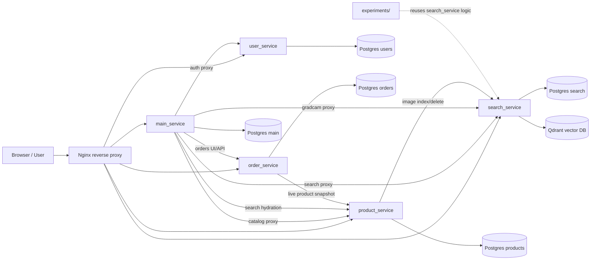
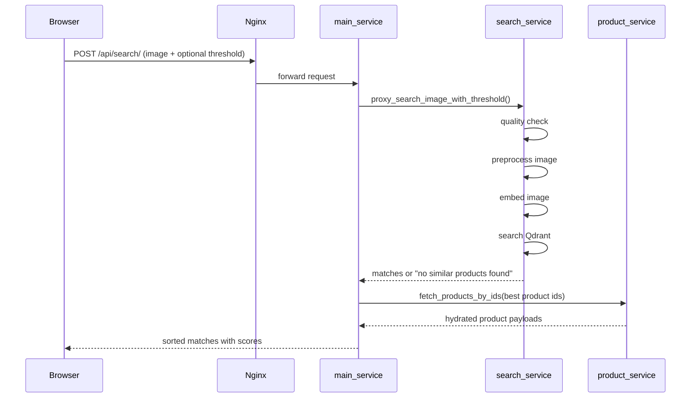
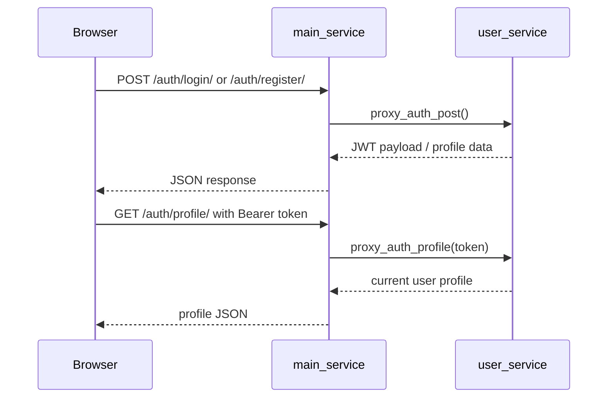
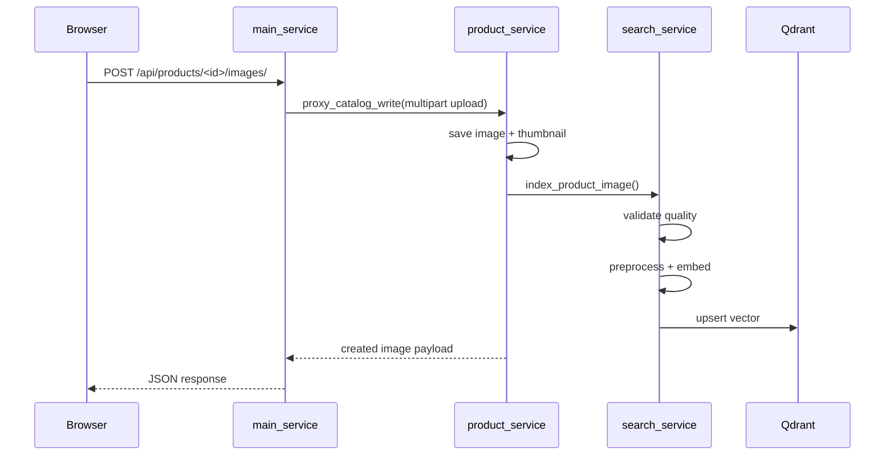
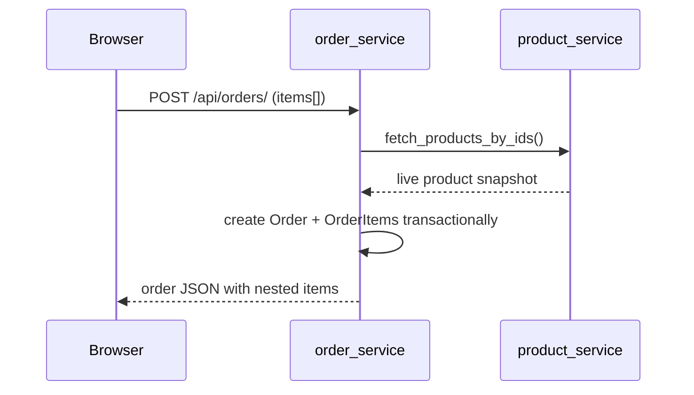
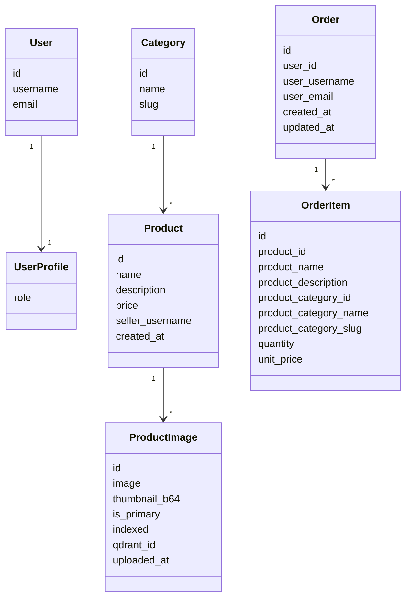

# CODEBASE_EXPLAINED.md

> Source-based walkthrough of the repo. Generated/runtime artifacts and secrets are summarized, not printed.

## 1. Project Overview

This repo is a split Django system for an e-commerce demo called **Apex Motors**. It lets a user browse products, authenticate, create orders, upload product images, and run visual search over those images. The same codebase also includes a separate offline retrieval experiment pipeline for comparing embedding models.

What problem it solves: it separates **business logic** from **AI/search logic** so the storefront stays simple while image retrieval, embedding generation, Qdrant indexing, and Grad-CAM live in their own service.

Intended users:
- shoppers / demo users
- sellers/admins managing catalog data
- engineers running the stack locally
- researchers comparing retrieval models offline

---

## 2. High-Level Architecture



### Plain-language read

- **Nginx** is the public front door.
- **main_service** is the gateway/UI. It serves HTML/CSS/JS and proxies requests to the domain services.
- **user_service** owns auth and profile data.
- **product_service** owns catalog data and product images.
- **order_service** owns orders and stores snapshots of product data at purchase time.
- **search_service** owns ML/image-search logic and vector search.
- **Qdrant** stores embeddings for similarity search.
- **PostgreSQL** is split per service, so each service owns its own database.
- **experiments/** reuses search-service logic for offline evaluation.

---

## 3. Tech Stack & Key Decisions

| Tech | What it is | Why used here | Alternative not chosen |
|---|---|---|---|
| Django | Web framework | Each service is a Django app with fast CRUD, admin, migrations, and templating | A custom HTTP framework would be more work and less idiomatic |
| Django REST Framework | API layer | Clean serializers, permissions, and class-based views for each service | Hand-written JSON views would be noisier and harder to test |
| SimpleJWT | Auth | Stateless bearer-token auth works well across service boundaries | Session auth would couple browser state to one service |
| PostgreSQL | Primary relational DB | Durable data for users, products, orders, and search metadata | SQLite is too weak for multi-service, Dockerized work |
| Qdrant | Vector DB | Built for similarity search and metadata payloads | Storing vectors in Postgres or ad-hoc arrays would not scale as well |
| Nginx | Reverse proxy | Routes public paths to the right backend services and serves static/media | App-level routing alone would not cleanly isolate services |
| Docker Compose | Local orchestration | Boots all services, DBs, and Qdrant consistently | Manual process startup would be fragile |
| Pillow | Image processing | Thumbnail generation, quality checks, cropping, Grad-CAM overlays | OpenCV would be heavier for this use case |
| torch / transformers / timm | ML stack | Embedding models, notebook checkpoints, DINOv2/CLIP support | Hard-coding embeddings or using a simpler feature extractor |
| KaggleHub | Demo dataset download | Seeds the catalog from a public dataset | Shipping a large dataset in the repo would be messy |
| Standard-library `urllib` | HTTP proxying | Lightweight service-to-service calls without extra dependencies | `requests`/`httpx` would work, but add another dependency without much benefit |

### Key design choices

- **We used multiple Django services instead of one monolith because** auth, catalog, orders, and ML/search change for different reasons and have different dependency footprints.
- **We used Qdrant instead of pgvector because** the search service is explicitly a vector-search service and Qdrant keeps indexing/search concerns separate from relational data.
- **We used local filesystem media instead of S3 because** the project is optimized for local demoing and zero cloud cost.
- **We used JWT instead of Django sessions because** requests travel across services and need a stateless auth token.
- **We used templates + vanilla JS instead of a SPA because** the UI is demo-oriented and much easier to run as part of the Django gateway.

---

## 4. Project Structure Walkthrough

```text
project-dl-wams/
├── docker-compose.yml
├── .env.example
├── .gitignore
├── PRD.md
├── END_TO_END.md
├── run-demo.md
├── tasks.md
├── main_service/
├── user_service/
├── product_service/
├── order_service/
├── search_service/
└── experiments/
```

### Folder responsibilities

- **`main_service/`**  
  Public gateway + HTML UI. Proxies to other services and renders storefront/auth/demo pages.

- **`user_service/`**  
  Authentication and user-profile source of truth.

- **`product_service/`**  
  Catalog, product images, media storage, and indexing triggers.

- **`order_service/`**  
  Orders and order-item snapshots.

- **`search_service/`**  
  Image preprocessing, quality checks, embeddings, Qdrant, OOD filtering, Grad-CAM.

- **`experiments/`**  
  Offline retrieval manifests, training, metrics, and comparisons.

- **Top-level docs**  
  `PRD.md`, `END_TO_END.md`, `run-demo.md`, and `tasks.md` define the intended architecture, operational workflow, and implementation status.

- **Generated/runtime artifacts**  
  `main_service/media/`, `main_service/.demo_dataset_cache/`, `experiments/artifacts/`, `evidence/`, `.pyc`, and `__pycache__` are outputs or caches, not source.

---

## 5. File-by-File Deep Dive

### 5.1 Top-level files

#### `PRD.md`
- **Purpose**: canonical product spec for the split-stack visual search system.
- **Why it exists**: it explains the intended architecture and feature scope.
- **How it works**: describes services, goals, non-goals, API shape, and phased work.
- **Key decisions**: we used a spec instead of tribal knowledge because the repo has multiple services and ML dependencies.
- **Alternatives considered**: a README-only setup; that would be too shallow.
- **Connections**: informs almost every service-level design choice.

#### `END_TO_END.md`
- **Purpose**: runbook for starting the full stack and seeding demo data.
- **Why it exists**: the system needs specific credentials, services, and seeding steps.
- **How it works**: documents `docker compose up -d --build`, Kaggle credentials, and service URLs.
- **Key decisions**: we used an operational runbook instead of burying setup in code comments because the stack is cross-service.
- **Alternatives considered**: a single README; less maintainable for operational steps.
- **Connections**: references `docker-compose.yml`, `product_service` seed command, and search-service model env vars.

#### `run-demo.md`
- **Purpose**: short demo-oriented setup notes.
- **Why it exists**: gives a fast path for someone trying the app.
- **How it works**: condensed steps for env copy, compose up, seeding, and URLs.
- **Key decisions**: we used a short doc instead of making the main runbook terse.
- **Alternatives considered**: putting demo steps in `PRD.md`; wrong place.
- **Connections**: same runtime flow as `END_TO_END.md`.

#### `tasks.md`
- **Purpose**: milestone tracker.
- **Why it exists**: shows what parts of the system were planned and completed.
- **How it works**: checklist by phase, from infra to retrieval search.
- **Key decisions**: we used a living checklist because the repo spans many subsystems.
- **Alternatives considered**: external issue tracker only; less visible in-repo.
- **Connections**: reflects actual code present in every service.

#### `docker-compose.yml`
- **Purpose**: boots the whole local system.
- **Why it exists**: each service has its own DB, runtime, and port.
- **How it works**: starts five Postgres containers, Qdrant, five Django services, and Nginx; wires shared media and env vars.
- **Key decisions**: we used Compose instead of manual process management because the stack is too large to start by hand.
- **Alternatives considered**: Kubernetes; far too heavy for local demo work.
- **Connections**: every service’s `settings.py`, `Dockerfile`, and port assumptions depend on this file.

#### `.env.example`
- **Purpose**: template for local configuration.
- **Why it exists**: documents required env vars without exposing secrets.
- **How it works**: defines DB names, JWT key, service URLs, Qdrant URL, search thresholds, and optional model paths.
- **Key decisions**: we used an example file instead of committing secrets.
- **Alternatives considered**: hard-coded settings; too brittle.
- **Connections**: consumed by every service’s settings module and by the search model registry.

#### `.gitignore`
- **Purpose**: excludes local-only files.
- **Why it exists**: prevents secrets, caches, downloads, and model artifacts from entering git.
- **How it works**: ignores `.env`, `.codex`, `__pycache__`, `.demo_dataset_cache`, SQLite files, and model artifacts.
- **Key decisions**: we used explicit ignores because the repo produces many heavy local files.
- **Alternatives considered**: no ignore file; unsafe.
- **Connections**: protects the generated folders used by the services and experiments.

#### `experiments/README.md`
- **Purpose**: explains offline retrieval experiments.
- **Why it exists**: the experiment pipeline is separate from runtime services.
- **How it works**: documents manifest building, training, comparison, and output artifacts.
- **Key decisions**: we used a dedicated README because the experiment code reuses runtime logic but is not part of the web stack.
- **Alternatives considered**: mixing experiment docs into the service code; confusing.
- **Connections**: refers to `experiments/retrieval/*` and runtime search-service preprocessing.

---

### 5.2 `main_service/`

#### `main_service/manage.py`, `main_service/Dockerfile`, `main_service/requirements.txt`
- **Purpose**: standard Django entrypoint, container build, and dependency list.
- **Why it exists**: this service is independently deployable.
- **How it works**: starts Django with `config.settings`; container exposes port 8000; requirements include Django, DRF, JWT, Postgres driver, Pillow.
- **Key decisions**: we used a separate container and dependency set because the gateway has different needs than search.
- **Alternatives considered**: shared dependency monolith; would be harder to ship and reason about.
- **Connections**: all `main_service/config/*` and `apps/*` files.

#### `main_service/config/settings.py`
- **Purpose**: gateway service configuration.
- **Why it exists**: controls DB, hosts, media, proxy URLs, and DRF/JWT behavior.
- **How it works**: uses Postgres, loads `SEARCH_SERVICE_URL`, `PRODUCT_SERVICE_URL`, `USER_SERVICE_URL`, `UPSTREAM_TIMEOUT_SECONDS`, and media/static settings.
- **Key decisions**: we used per-service DB and upstream URLs instead of shared globals because the gateway is only a coordinator.
- **Alternatives considered**: shared config module; would blur service ownership.
- **Connections**: used by `apps/core/views.py`, `apps/users/views.py`, proxy services, and templates/media serving.

#### `main_service/config/urls.py`
- **Purpose**: top-level route map.
- **Why it exists**: connects homepage, demo page, auth UI/API, and core API.
- **How it works**: routes `/`, `/demo/`, `/auth/`, `/api/auth/`, `/api/`, and admin; serves media in debug.
- **Key decisions**: we used a thin URL config so the gateway stays easy to audit.
- **Alternatives considered**: putting all routes in one app; too messy.
- **Connections**: `apps/core/views.py`, `apps/users/views.py`, `apps/users/ui_urls.py`, `apps/users/urls.py`, `apps/core/urls.py`.

#### `main_service/config/asgi.py`, `wsgi.py`, `__init__.py`
- **Purpose**: standard Django project scaffolding.
- **Why it exists**: needed for app server compatibility.
- **How it works**: exposes ASGI/WSGI application objects.
- **Key decisions**: default Django structure kept untouched.
- **Alternatives considered**: custom bootstrap; unnecessary.
- **Connections**: deployment/runtime only.

#### `main_service/apps/core/views.py`
- **Purpose**: gateway API logic.
- **Why it exists**: main_service is the public coordination layer.
- **How it works**:  
  - `health()` checks DB connectivity.  
  - `SearchView.post()` forwards the uploaded image to search service, then hydrates matches from product service and sorts by score (`main_service/apps/core/views.py:33-109`).  
  - `ProductListView` and `ProductCategoryView` proxy catalog reads/writes.  
  - `ProductImageUploadView` forwards multipart uploads to product service.  
  - `GradCamView` forwards images to search service.  
  - `DemoPageView` renders the demo page.
- **Key decisions**: we used a gateway instead of exposing every backend service directly because the UI needs one stable entrypoint.
- **Alternatives considered**: direct browser-to-service calls; that would scatter auth and hydration logic.
- **Connections**: `services/catalog_proxy.py`, `services/search_proxy.py`, `apps/users/views.py`, templates.

#### `main_service/apps/core/services/catalog_proxy.py`
- **Purpose**: client for product-service reads/writes.
- **Why it exists**: the gateway needs normalized product payloads.
- **How it works**: fetches JSON via `urllib`, normalizes `image_url` paths so media URLs work through the gateway, and proxies catalog writes with upstream error translation (`main_service/apps/core/services/catalog_proxy.py:19-106`).
- **Key decisions**: we used lightweight `urllib` instead of a third-party HTTP client because the proxy layer is small.
- **Alternatives considered**: `requests`; easier ergonomics, but not necessary.
- **Connections**: `main_service/apps/core/views.py`, product service API.

#### `main_service/apps/core/services/search_proxy.py`
- **Purpose**: client for search/index/Grad-CAM operations.
- **Why it exists**: the gateway should not embed ML logic.
- **How it works**: builds multipart requests for search/index/gradcam and deletes product vectors by product id (`main_service/apps/core/services/search_proxy.py:46-123`).
- **Key decisions**: we used direct service-to-service HTTP so search stays isolated.
- **Alternatives considered**: importing search-service internals directly; that would destroy service boundaries.
- **Connections**: `main_service/apps/core/views.py`, search service API.

#### `main_service/apps/core/permissions.py`
- **Purpose**: role-based gateway permissions.
- **Why it exists**: sellers/admins can write; clients cannot.
- **How it works**: reads `role` from request user or token claims and checks whether writes are allowed.
- **Key decisions**: we used token-claim fallback because the gateway may receive stateless JWT-authenticated requests.
- **Alternatives considered**: database lookups on every request; slower and more coupled.
- **Connections**: `main_service/apps/core/views.py`, `product_service/apps/products/permissions.py`.

#### `main_service/apps/core/tests.py`
- **Purpose**: verifies gateway behavior.
- **Why it exists**: proxy logic and page rendering are easy to break.
- **How it works**: tests search hydration, OOD pass-through, landing/demo/auth pages, and gateway permissions.
- **Key decisions**: we used mocked upstreams so the gateway can be tested without the whole stack.
- **Alternatives considered**: only integration tests; slower and harder to isolate.
- **Connections**: `views.py`, `permissions.py`, UI templates.

#### `main_service/apps/core/management/commands/demo_smoke.py`
- **Purpose**: end-to-end smoke test.
- **Why it exists**: validates the gateway path, search path, and Grad-CAM path together.
- **How it works**: runs migrations, hits `/`, `/demo/`, `/api/search/`, and `/api/gradcam/`, with upstream proxies patched during the test (`main_service/apps/core/management/commands/demo_smoke.py:19-76`).
- **Key decisions**: we used a command instead of ad-hoc shell steps because it is repeatable.
- **Alternatives considered**: manual checklist only; too fragile.
- **Connections**: `main_service/apps/core/views.py`.

#### `main_service/apps/core/templates/core/demo.html`
- **Purpose**: demo dashboard page.
- **Why it exists**: exposes search and Grad-CAM flows in one UI.
- **How it works**: rendered by `DemoPageView`.
- **Key decisions**: we used a server-rendered template for easy local demoing.
- **Alternatives considered**: SPA demo page; unnecessary for this project.
- **Connections**: `DemoPageView`.

#### `main_service/apps/users/views.py`
- **Purpose**: auth UI and auth API wrapper.
- **Why it exists**: the browser should talk to the gateway, not directly to auth service.
- **How it works**:  
  - API views proxy register/login/profile to `user_service` (`main_service/apps/users/views.py:9-43`).  
  - Template views render landing/login/register/profile/seller pages.
- **Key decisions**: we used a gateway wrapper so the browser only needs one origin.
- **Alternatives considered**: direct user-service UI; less cohesive.
- **Connections**: `services/auth_proxy.py`, auth templates, `ui_urls.py`, `urls.py`.

#### `main_service/apps/users/services/auth_proxy.py`
- **Purpose**: proxy for register/login/profile calls.
- **Why it exists**: keeps auth HTTP logic out of views.
- **How it works**: posts JSON for register/login, forwards bearer token for profile, translates upstream failures into `AuthServiceError` (`main_service/apps/users/services/auth_proxy.py:21-52`).
- **Key decisions**: `urllib` again keeps dependencies low.
- **Alternatives considered**: a shared SDK module; not needed here.
- **Connections**: `apps/users/views.py`, `user_service` auth endpoints.

#### `main_service/apps/users/serializers.py`
- **Purpose**: shape auth/profile payloads for the gateway UI.
- **Why it exists**: templates and JS expect stable JSON shapes.
- **How it works**: mirrors user registration and profile fields.
- **Key decisions**: kept simple because the gateway is not the source of truth.
- **Alternatives considered**: custom DTO layer; overkill.
- **Connections**: frontend forms and auth proxy responses.

#### `main_service/apps/users/urls.py`, `ui_urls.py`
- **Purpose**: separate API and page routes.
- **Why it exists**: clean separation between browser pages and API endpoints.
- **How it works**: `urls.py` serves register/login/profile APIs; `ui_urls.py` serves HTML pages.
- **Key decisions**: we used two route sets instead of mixing concerns.
- **Alternatives considered**: one URL file; harder to scan.
- **Connections**: `main_service/config/urls.py`.

#### `main_service/apps/users/templates/users/base.html`
- **Purpose**: shared layout shell.
- **Why it exists**: all auth/storefront pages need the same header/nav and JS bootstrapping.
- **How it works**: includes shared CSS, nav links, and the `window.__wamsInit` boot function.
- **Key decisions**: we used one base template to keep page chrome consistent.
- **Alternatives considered**: duplicating header markup on every page; bad maintenance.
- **Connections**: all user templates.

#### `main_service/apps/users/templates/users/index.html`
- **Purpose**: storefront landing page.
- **Why it exists**: main shopping entrypoint.
- **How it works**: renders inventory grid and listing panel, with JS wiring for search results.
- **Key decisions**: we used a dense single-page layout because discovery and product selection happen together.
- **Alternatives considered**: separate category/product pages; more navigation friction.
- **Connections**: `site.js`, `main_service/apps/core/views.SearchView`.

#### `main_service/apps/users/templates/users/login.html`
- **Purpose**: login form page.
- **Why it exists**: lets users get JWT tokens from the gateway UI.
- **How it works**: form posts to gateway auth API and stores token client-side.
- **Key decisions**: we used localStorage-based token flow because the UI is demo-first.
- **Alternatives considered**: server sessions; would reduce cross-service clarity.
- **Connections**: `auth_proxy.py`, `user_service` login endpoint.

#### `main_service/apps/users/templates/users/register.html`
- **Purpose**: account creation page.
- **Why it exists**: makes it easy to create seller/client accounts in the demo.
- **How it works**: posts registration data to the auth API.
- **Key decisions**: we used a combined register form so the UI stays simple.
- **Alternatives considered**: registration via admin only; too limiting.
- **Connections**: `auth_proxy.py`, `user_service` registration endpoint.

#### `main_service/apps/users/templates/users/profile.html`
- **Purpose**: profile/session page.
- **Why it exists**: lets the user inspect the stored token-backed profile.
- **How it works**: fetches profile via bearer token and displays current session state.
- **Key decisions**: we used a live profile fetch instead of cached profile data because JWT claims may change.
- **Alternatives considered**: static profile display; would go stale.
- **Connections**: `auth_proxy.py`, `user_service` profile endpoint.

#### `main_service/apps/users/templates/users/seller.html`
- **Purpose**: seller catalog-entry page.
- **Why it exists**: exposes product/category/image upload flows in the UI.
- **How it works**: lets a seller create listings and upload multiple images.
- **Key decisions**: we used one seller page because the demo needs a clear seller workflow.
- **Alternatives considered**: admin-only product creation; less demo-friendly.
- **Connections**: product-service proxy endpoints, seller/admin permissions.

#### `main_service/apps/users/static/users/site.css`
- **Purpose**: styling for the UI.
- **Why it exists**: the storefront and auth pages need shared visual design.
- **How it works**: defines the page shell, panels, forms, cards, and responsive layout.
- **Key decisions**: we used plain CSS instead of a build step because the UI is modest.
- **Alternatives considered**: Tailwind/build tooling; unnecessary overhead.
- **Connections**: all user templates.

#### `main_service/apps/users/static/users/site.js`
- **Purpose**: browser interactivity.
- **Why it exists**: handles form submissions, session storage, rendering helpers, and storefront behavior.
- **How it works**: defines formatting helpers, image rendering, and UI behavior for the auth/storefront pages.
- **Key decisions**: we used vanilla JS so the app stays dependency-light.
- **Alternatives considered**: React/Vue; too much for the current demo.
- **Connections**: all templates, especially index/login/profile/seller pages.

---

### 5.3 `user_service/`

#### `user_service/manage.py`, `Dockerfile`, `requirements.txt`
- **Purpose**: standard service entrypoint, container, dependencies.
- **Why it exists**: user auth is independently deployable.
- **How it works**: Django + DRF + SimpleJWT + Postgres.
- **Key decisions**: separate service and dependency set because auth must stay isolated.
- **Alternatives considered**: sharing auth with main_service; would blur ownership.
- **Connections**: `config/*`, `apps/*`.

#### `user_service/config/settings.py`
- **Purpose**: auth-service configuration.
- **Why it exists**: defines DB, hosts, JWT settings, and DRF auth.
- **How it works**: uses `JWTStatelessUserAuthentication`, `SIMPLE_JWT` signing key, and Postgres (`user_service/config/settings.py:63-104`).
- **Key decisions**: we used stateless JWT auth because the gateway and other services should not share sessions.
- **Alternatives considered**: session auth; less suitable for cross-service calls.
- **Connections**: `apps/users/views.py`, `apps/users/serializers.py`.

#### `user_service/config/urls.py`
- **Purpose**: service route map.
- **Why it exists**: exposes admin and auth API endpoints.
- **How it works**: routes `/api/auth/` to user app URLs.
- **Key decisions**: simple route surface is easier to proxy from the gateway.
- **Alternatives considered**: nested routers; not needed.
- **Connections**: `apps/users/urls.py`, admin.

#### `user_service/apps/core/views.py`
- **Purpose**: health endpoint.
- **Why it exists**: orchestration and monitoring need a quick DB-backed check.
- **How it works**: runs `SELECT 1` and returns `ok` or `degraded`.
- **Key decisions**: DB check included because the service can be “up” while the database is not.
- **Alternatives considered**: pure liveness check; too shallow.
- **Connections**: `config/urls.py`.

#### `user_service/apps/users/models.py`
- **Purpose**: user role model.
- **Why it exists**: roles are business state, not just auth metadata.
- **How it works**: stores `UserProfile` with `role` enum (`admin`, `seller`, `client`) linked one-to-one with Django `User` (`user_service/apps/users/models.py:5-17`).
- **Key decisions**: we used a separate profile instead of adding custom auth fields because Django’s built-in `User` remains intact.
- **Alternatives considered**: custom user model; more invasive than needed.
- **Connections**: serializers, views, JWT role claims.

#### `user_service/apps/users/serializers.py`
- **Purpose**: registration, profile, and role-aware token serialization.
- **Why it exists**: the auth API needs to create users and expose roles.
- **How it works**:  
  - `RegistrationSerializer` creates `User` and `UserProfile`.  
  - `UserProfileSerializer` returns the current user.  
  - `RoleAwareTokenObtainPairSerializer` adds role claims to JWTs (`user_service/apps/users/serializers.py:17-57`).
- **Key decisions**: we used role claims in JWTs so downstream services can authorize without extra DB lookups.
- **Alternatives considered**: role lookup on every request; slower and more coupled.
- **Connections**: `views.py`, gateway permissions.

#### `user_service/apps/users/views.py`
- **Purpose**: auth endpoints.
- **Why it exists**: the user service is the source of truth for login, registration, and profile.
- **How it works**: `RegisterView` and `LoginView` use serializers; `ProfileView` returns the authenticated user (`user_service/apps/users/views.py:7-22`).
- **Key decisions**: kept auth endpoints narrow and explicit.
- **Alternatives considered**: a full auth subsystem with reset/verification flows; out of scope here.
- **Connections**: serializers and URLs.

#### `user_service/apps/users/urls.py`
- **Purpose**: auth route map.
- **Why it exists**: exposes `/api/auth/register/`, `/login/`, and `/profile/`.
- **How it works**: simple path list.
- **Key decisions**: explicit endpoints are easy to proxy.
- **Alternatives considered**: router-generated endpoints; not needed.
- **Connections**: gateway auth proxy.

#### `user_service/apps/core/urls.py`
- **Purpose**: health route map.
- **Why it exists**: exposes `/api/health/`.
- **How it works**: maps directly to the health view.
- **Key decisions**: simple and predictable.
- **Alternatives considered**: shared health route; not necessary.
- **Connections**: orchestrator and monitoring.

#### `user_service/apps/users/migrations/0001_userprofile.py`
- **Purpose**: creates the profile table.
- **Why it exists**: role storage needs a schema.
- **How it works**: one-to-one profile + role field.
- **Key decisions**: migration-first schema keeps auth portable.
- **Alternatives considered**: inline user extension via auth tables; less explicit.
- **Connections**: `models.py`.

---

### 5.4 `product_service/`

#### `product_service/manage.py`, `Dockerfile`, `requirements.txt`
- **Purpose**: service entrypoint, container, dependencies.
- **Why it exists**: catalog has its own runtime and image-processing needs.
- **How it works**: Django + DRF + Pillow + KaggleHub + Postgres.
- **Key decisions**: separate package because this service owns uploads and demo seeding.
- **Alternatives considered**: merging into main_service; would concentrate too many responsibilities.
- **Connections**: `config/*`, product app, management commands.

#### `product_service/config/settings.py`
- **Purpose**: catalog-service configuration.
- **Why it exists**: sets DB, media, JWT auth, and search-service URL.
- **How it works**: uses `PRODUCT_SERVICE_URL`, `SEARCH_SERVICE_URL`, and media storage paths.
- **Key decisions**: we used local media and direct search-service wiring to keep the demo self-contained.
- **Alternatives considered**: S3 + async queue; better production shape, worse local simplicity.
- **Connections**: `apps/products/*`, management commands, signals.

#### `product_service/config/urls.py`
- **Purpose**: catalog route map.
- **Why it exists**: exposes admin and `/api/` endpoints.
- **How it works**: includes core and products routes; serves media in debug.
- **Key decisions**: standard Django route setup.
- **Alternatives considered**: router-only layout; not necessary.
- **Connections**: product API, health endpoint, media uploads.

#### `product_service/apps/core/views.py`
- **Purpose**: health endpoint.
- **Why it exists**: checks DB connectivity.
- **How it works**: same `SELECT 1` pattern as other services.
- **Key decisions**: consistent health payloads across services.
- **Alternatives considered**: no health endpoint; bad for orchestration.
- **Connections**: `core/urls.py`.

#### `product_service/apps/products/models.py`
- **Purpose**: catalog data model.
- **Why it exists**: products, categories, and images are the core business entities.
- **How it works**:  
  - `Category` auto-slugs its name.  
  - `Product` stores name, description, price, category, seller username, and timestamps.  
  - `ProductImage` stores the file, thumbnail b64, primary/indexed flags, qdrant id, and upload time (`product_service/apps/products/models.py:28-63`).
- **Key decisions**: we used denormalized `seller_username` and image metadata because the service needs to answer quickly and support search/indexing.
- **Alternatives considered**: normalized seller table or media-only metadata; more joins, less convenient.
- **Connections**: serializers, views, signals, admin, search proxy.

#### `product_service/apps/products/serializers.py`
- **Purpose**: API payloads for catalog.
- **Why it exists**: the gateway and UI need structured product data.
- **How it works**: nested category/image serializers, `image_url` generation, read/write split, and image upload field.
- **Key decisions**: nested read models make hydration easier for the gateway.
- **Alternatives considered**: flat payloads only; harder for UI to render.
- **Connections**: product views, gateway hydration, search results.

#### `product_service/apps/products/permissions.py`
- **Purpose**: write access and ownership checks.
- **Why it exists**: only sellers/admins should write, and sellers should only edit their own products.
- **How it works**: extracts role and username from user/token claims (`product_service/apps/products/permissions.py:4-53`).
- **Key decisions**: token-claim fallback avoids DB lookups and keeps JWT-driven auth consistent.
- **Alternatives considered**: DB permission checks every request; slower.
- **Connections**: product views, auth tokens.

#### `product_service/apps/products/views.py`
- **Purpose**: catalog CRUD and image upload API.
- **Why it exists**: serves the catalog domain.
- **How it works**: list/create categories, list/create products, retrieve/update/destroy products, and upload product images. Supports `ids=` filtering for hydration and uses multipart parsing for image upload.
- **Key decisions**: explicit endpoints are easier for the gateway to proxy than deep routers.
- **Alternatives considered**: a more generic API layout; would be less obvious.
- **Connections**: serializers, permissions, signals, search proxy.

#### `product_service/apps/products/urls.py`
- **Purpose**: product API routes.
- **Why it exists**: defines categories/products/images endpoints.
- **How it works**: straightforward path mapping.
- **Key decisions**: stable route names help the gateway proxy.
- **Alternatives considered**: router-generated paths; okay, but explicit is clearer here.
- **Connections**: `views.py`.

#### `product_service/apps/products/signals.py`
- **Purpose**: automatic indexing/deletion behavior.
- **Why it exists**: catalog image changes must sync to search.
- **How it works**: on `ProductImage` create, reads the file and calls search indexing; on delete, removes vectors and updates state (`product_service/apps/products/signals.py:37-52`).
- **Key decisions**: signals keep indexing close to the data change.
- **Alternatives considered**: background task queue; better at scale, but more infrastructure.
- **Connections**: search proxy, `ProductImage`.
- **Opinion**: this is convenient but brittle; synchronous search calls during model events can fail the write path if search is unavailable.

#### `product_service/apps/products/services/search_proxy.py`
- **Purpose**: talk to search_service.
- **Why it exists**: product_service should not know ML internals.
- **How it works**: builds multipart requests for indexing and deletion, translates failures into `SearchServiceError` (`product_service/apps/products/services/search_proxy.py:11-123`).
- **Key decisions**: direct HTTP keeps the service boundary intact.
- **Alternatives considered**: shared import of search code; bad coupling.
- **Connections**: signals, admin reindex command, product upload.

#### `product_service/apps/products/admin.py`
- **Purpose**: Django admin for catalog.
- **Why it exists**: makes local editing and debugging easier.
- **How it works**: registers category/product/image, shows inlines, and provides reindex action.
- **Key decisions**: admin is useful here because catalog data is central to the demo.
- **Alternatives considered**: no admin; slower development.
- **Connections**: models and search proxy.

#### `product_service/apps/products/apps.py`
- **Purpose**: app config and signal registration.
- **Why it exists**: ensures signals load when the app starts.
- **How it works**: `ready()` imports signals.
- **Key decisions**: standard Django pattern.
- **Alternatives considered**: importing signals elsewhere; less reliable.
- **Connections**: `signals.py`.

#### `product_service/apps/products/migrations/0001_initial.py`, `0002_product_seller_username.py`
- **Purpose**: schema creation and evolution.
- **Why it exists**: stores catalog tables and later adds seller username.
- **How it works**: first migration creates category/product/image tables; second adds indexed `seller_username`.
- **Key decisions**: explicit migrations preserve data history.
- **Alternatives considered**: schema reset; unsafe.
- **Connections**: `models.py`.

#### `product_service/apps/core/management/commands/seed_demo.py`
- **Purpose**: seed demo catalog data.
- **Why it exists**: the app needs sample inventory.
- **How it works**: downloads Kaggle data with KaggleHub, maps dataset items to products, and uploads product images in chunks.
- **Key decisions**: we used live dataset download rather than committing a huge asset bundle.
- **Alternatives considered**: static CSV/image bundle in git; too heavy.
- **Connections**: models, media storage, search indexing.

#### `product_service/apps/core/management/commands/reindex_product_images.py`
- **Purpose**: bulk search reindex.
- **Why it exists**: recovers from index drift or model changes.
- **How it works**: iterates images, sends bytes to search, stores qdrant IDs, and reports skipped images.
- **Key decisions**: command is better than a one-off script because it can be rerun.
- **Alternatives considered**: shell-only workflow; hard to repeat.
- **Connections**: search proxy, `ProductImage`.

#### `product_service/apps/products/tests.py`
- **Purpose**: verifies permissions and serializer behavior.
- **Why it exists**: role logic and seller mapping are easy to regress.
- **How it works**: checks client denial, seller ownership, and seller username fallback.
- **Key decisions**: focused unit tests instead of heavy integration for core rules.
- **Alternatives considered**: no tests; risky.
- **Connections**: permissions, serializers, models.

#### `product_service/apps/core/views.py`, `urls.py`, `apps/core/management/__init__.py`, `commands/__init__.py`, `apps/__init__.py`, `products/__init__.py`
- **Purpose**: package and route scaffolding.
- **Why it exists**: standard Django structure.
- **How it works**: mostly package markers plus health URL wiring.
- **Key decisions**: keep Django conventions intact.
- **Alternatives considered**: custom layout; unnecessary.
- **Connections**: Django import system.

---

### 5.5 `order_service/`

#### `order_service/manage.py`, `Dockerfile`, `requirements.txt`
- **Purpose**: service entrypoint, container, dependencies.
- **Why it exists**: orders have their own DB and runtime.
- **How it works**: Django + DRF + JWT + Postgres.
- **Key decisions**: separate service isolates order logic and snapshot storage.
- **Alternatives considered**: embedding orders in catalog; confusing.
- **Connections**: `config/*`, `apps/orders/*`.

#### `order_service/config/settings.py`
- **Purpose**: order-service configuration.
- **Why it exists**: sets DB, JWT auth, media, and product-service URL.
- **How it works**: uses `JWTStatelessUserAuthentication`, `PRODUCT_SERVICE_URL`, and Postgres (`order_service/config/settings.py:63-104`).
- **Key decisions**: stateless auth keeps the service independent.
- **Alternatives considered**: session auth; worse across services.
- **Connections**: serializers, views, catalog client.

#### `order_service/config/urls.py`
- **Purpose**: service route map.
- **Why it exists**: exposes admin and order API.
- **How it works**: includes core and order URLs.
- **Key decisions**: explicit is easier to proxy.
- **Alternatives considered**: more abstraction; unnecessary.
- **Connections**: `apps/orders/urls.py`.

#### `order_service/apps/core/views.py`
- **Purpose**: health endpoint.
- **Why it exists**: orchestration check.
- **How it works**: DB connectivity probe.
- **Key decisions**: consistent health payloads.
- **Alternatives considered**: no health route; poor observability.
- **Connections**: `core/urls.py`.

#### `order_service/apps/orders/models.py`
- **Purpose**: order snapshot model.
- **Why it exists**: order history should preserve the product at purchase time.
- **How it works**:  
  - `Order` stores user id, username, email, timestamps.  
  - `OrderItem` stores denormalized product/category fields, quantity, and unit price (`order_service/apps/orders/models.py:4-31`).
- **Key decisions**: we used snapshots instead of live joins because orders must remain historically correct.
- **Alternatives considered**: direct foreign keys to live product rows only; bad for audit/history.
- **Connections**: serializers, admin, views.

#### `order_service/apps/orders/serializers.py`
- **Purpose**: create/read order payloads.
- **Why it exists**: order creation and readback are different shapes.
- **How it works**:  
  - create serializer validates items, fetches current product data, and creates snapshots transactionally (`order_service/apps/orders/serializers.py:68-119`).  
  - read serializer hydrates nested item payloads and falls back to snapshots if live product data is unavailable.
- **Key decisions**: we used transaction.atomic because order creation must be all-or-nothing.
- **Alternatives considered**: partial-order creation; bad user experience.
- **Connections**: catalog client, views, models.

#### `order_service/apps/orders/services/catalog_client.py`
- **Purpose**: fetch product data from catalog service.
- **Why it exists**: order snapshots need live product metadata at creation time.
- **How it works**: calls product service `/api/products/?ids=...` and raises `CatalogServiceError` on bad upstream responses.
- **Key decisions**: again, `urllib` keeps the dependency surface small.
- **Alternatives considered**: shared DB or shared ORM; too coupled.
- **Connections**: serializers, views.

#### `order_service/apps/orders/views.py`
- **Purpose**: order list/create/detail API.
- **Why it exists**: users need to create and inspect orders.
- **How it works**: filters orders by authenticated user, injects live product maps into serializer context, and returns the read serializer after create (`order_service/apps/orders/views.py:30-64`).
- **Key decisions**: order list/detail are user-scoped to avoid cross-user leakage.
- **Alternatives considered**: admin-like global order list; not appropriate.
- **Connections**: serializers, catalog client, models.

#### `order_service/apps/orders/urls.py`
- **Purpose**: order routes.
- **Why it exists**: maps `/api/orders/` and `/api/orders/<pk>/`.
- **How it works**: direct path map.
- **Key decisions**: explicit endpoints are easy to understand.
- **Alternatives considered**: router-only API; okay but not necessary.
- **Connections**: views.

#### `order_service/apps/orders/admin.py`
- **Purpose**: admin UI for orders.
- **Why it exists**: local debugging and inspection.
- **How it works**: shows order items inline and registers both models.
- **Key decisions**: admin is valuable because orders are denormalized snapshots.
- **Alternatives considered**: no admin; less convenient.
- **Connections**: models.

#### `order_service/apps/orders/migrations/0001_initial.py`
- **Purpose**: order schema.
- **Why it exists**: creates order and item tables.
- **How it works**: initial migration only.
- **Key decisions**: standard migration flow.
- **Alternatives considered**: schema reset; not okay.
- **Connections**: `models.py`.

#### `order_service/apps/core/urls.py`, `apps/__init__.py`, `apps/core/apps.py`, `apps/orders/apps.py`
- **Purpose**: standard package and route scaffolding.
- **Why it exists**: Django app wiring.
- **How it works**: package markers and app config.
- **Key decisions**: keep conventional Django structure.
- **Alternatives considered**: custom app loading; unnecessary.
- **Connections**: Django startup.

---

### 5.6 `search_service/`

#### `search_service/manage.py`, `Dockerfile`, `requirements.txt`
- **Purpose**: ML/search service entrypoint, image, dependencies.
- **Why it exists**: search is the heaviest runtime and needs its own dependency set.
- **How it works**: Django + DRF + Postgres + Qdrant client + Pillow + torch + transformers + timm.
- **Key decisions**: separate service because ML dependencies are large and evolve independently.
- **Alternatives considered**: folding ML into the gateway; bad separation.
- **Connections**: all `search_service/apps/search/*`.

#### `search_service/config/settings.py`
- **Purpose**: search-service configuration.
- **Why it exists**: controls Postgres, Qdrant, model registry, and preprocessing heuristics.
- **How it works**: sets `QDRANT_URL`, `MAIN_SERVICE_URL`, model sources/checkpoints, OOD thresholds, and preprocessing flags (`search_service/config/settings.py:64-118`).
- **Key decisions**: we used registry-style config so model choice can change without code edits.
- **Alternatives considered**: hard-coded model paths; brittle.
- **Connections**: model registry, embedder, qdrant, preprocess, visualization.

#### `search_service/config/urls.py`
- **Purpose**: search API routes.
- **Why it exists**: exposes health, demo, products, search, and gradcam endpoints.
- **How it works**: standard include-based URL map.
- **Key decisions**: direct routes keep the ML API obvious.
- **Alternatives considered**: router-only endpoints; not needed.
- **Connections**: `apps/search/views.py`, core health.

#### `search_service/apps/core/views.py`
- **Purpose**: health endpoint.
- **Why it exists**: DB-backed service health.
- **How it works**: same connectivity check pattern as other services.
- **Key decisions**: consistent across services.
- **Alternatives considered**: no health route; poor operational visibility.
- **Connections**: `core/urls.py`.

#### `search_service/apps/search/models.py`
- **Purpose**: none.
- **Why it exists**: there is no Django model file for search; the service stores vectors in Qdrant and only uses Postgres for service-level data.
- **How it works**: N/A.
- **Key decisions**: search state lives outside Django ORM.
- **Alternatives considered**: Django models for vectors; less suitable than Qdrant.
- **Connections**: Qdrant service.

#### `search_service/apps/search/serializers.py`
- **Purpose**: validate request/response shapes.
- **Why it exists**: image search/index APIs need strict input validation.
- **How it works**: defines index/search request serializers and match serializer.
- **Key decisions**: lightweight serializers keep API parsing disciplined.
- **Alternatives considered**: manual request dict handling; more error-prone.
- **Connections**: `views.py`.

#### `search_service/apps/search/views.py`
- **Purpose**: indexing, search, delete, and Grad-CAM API.
- **Why it exists**: this is the core search contract.
- **How it works**:  
  - `IndexView` validates image quality, preprocesses, embeds, and upserts vector into Qdrant.  
  - `SearchView` validates quality, preprocesses, embeds, searches Qdrant, applies OOD filtering, and returns matches (`search_service/apps/search/views.py:23-115`).  
  - `DeleteIndexView` removes vectors by product id.  
  - `GradCamView` builds overlays for supported models (`search_service/apps/search/views.py:124-141`).
- **Key decisions**: we kept ML behavior behind a small REST API instead of exposing internal model code to the rest of the repo.
- **Alternatives considered**: direct function calls from product/main services; too tightly coupled.
- **Connections**: preprocess, quality, qdrant, embedder, model registry, visualization, serializers.

#### `search_service/apps/search/services/quality.py`
- **Purpose**: image quality gate.
- **Why it exists**: bad query images produce bad embeddings.
- **How it works**: rejects too-small, too-dark, too-bright, or too-flat images.
- **Key decisions**: heuristics are simple and fast.
- **Alternatives considered**: learned image-quality model; overkill here.
- **Connections**: search and index views.

#### `search_service/apps/search/services/preprocess.py`
- **Purpose**: foreground cropping / optional background removal.
- **Why it exists**: better embeddings come from tighter crops.
- **How it works**: optionally uses `rembg`, otherwise estimates a background color and crops the foreground box (`search_service/apps/search/services/preprocess.py:14-103`).
- **Key decisions**: we used heuristic preprocessing because it is easy to deploy and tune.
- **Alternatives considered**: no preprocessing or a fully learned segmentation pipeline.
- **Connections**: search/index views, experiments pipeline.

#### `search_service/apps/search/services/model_registry.py`
- **Purpose**: model catalog and collection mapping.
- **Why it exists**: the service supports multiple embedding variants.
- **How it works**: defines `ModelSpec` entries for CLIP and DINOv2 variants, including checkpoint path, vector size, collection name, and Grad-CAM support (`search_service/apps/search/services/model_registry.py:16-113`).
- **Key decisions**: separate collections per model avoid vector collisions.
- **Alternatives considered**: one shared collection with model tags; riskier.
- **Connections**: embedder, qdrant, visualization, experiments.

#### `search_service/apps/search/services/embedder.py`
- **Purpose**: lazy model loading and embedding.
- **Why it exists**: embedding models are heavy and should load once per process.
- **How it works**: caches embedder instances per model family, loads torch only when needed, and selects CPU/GPU dynamically (`search_service/apps/search/services/embedder.py:10-90`).
- **Key decisions**: lazy loading keeps startup tolerable.
- **Alternatives considered**: eager loading; slower boot and bigger memory hit.
- **Connections**: views, visualization, model registry.

#### `search_service/apps/search/services/notebook_artifacts.py`
- **Purpose**: load notebook-exported CLIP/DINO/triplet artifacts.
- **Why it exists**: the project supports Colab-trained checkpoints.
- **How it works**: can load CLIP and DINO variants, infer projection size, and handle triplet fine-tuned checkpoints via timm (`search_service/apps/search/services/notebook_artifacts.py:88-204`).
- **Key decisions**: flexible loading avoids forcing one training/export format.
- **Alternatives considered**: only supporting a single checkpoint format; too restrictive.
- **Connections**: embedder, experiments, docs.

#### `search_service/apps/search/services/qdrant.py`
- **Purpose**: vector DB operations.
- **Why it exists**: Qdrant is the similarity-search backend.
- **How it works**: ensures collections, upserts vectors, searches via Qdrant HTTP API, deletes by product id, and maintains collection-mean caches for OOD logic (`search_service/apps/search/services/qdrant.py:49-195`).
- **Key decisions**: used Qdrant client for lifecycle and HTTP for search to keep the code straightforward.
- **Alternatives considered**: direct gRPC or another vector store; not necessary.
- **Connections**: embedder, views, model registry, OOD checks.

#### `search_service/apps/search/services/visualization.py`
- **Purpose**: Grad-CAM overlay generation.
- **Why it exists**: the demo needs explainability visuals.
- **How it works**: uses model internals to compute gradients, build a heatmap, colorize it, and return base64 PNG output.
- **Key decisions**: Grad-CAM only for supported model families because not every encoder exposes the right internals.
- **Alternatives considered**: no explainability layer; weaker demo story.
- **Connections**: `GradCamView`, model registry, embedder.

#### `search_service/apps/search/views.py` OOD behavior
- **Purpose**: suppress weak/unreliable results.
- **Why it exists**: nearest neighbors can still be bad matches.
- **How it works**: checks query-vector similarity against collection mean and filters on top-score threshold before returning results.
- **Key decisions**: heuristic OOD filters are simple to tune.
- **Alternatives considered**: no gating or a learned outlier detector.
- **Connections**: `qdrant.py`, `config/settings.py`.

#### `search_service/apps/search/tests.py`
- **Purpose**: smoke tests for search/Grad-CAM infrastructure.
- **Why it exists**: the ML path is easy to break.
- **How it works**: tests image-quality rejection, indexing, search, OOD handling, preprocessing, Qdrant HTTP behavior, model registry, Grad-CAM, and cache isolation.
- **Key decisions**: broad smoke coverage is warranted because the service has many moving parts.
- **Alternatives considered**: only unit tests; not enough here.
- **Connections**: all search-service internals.

#### `search_service/apps/core/apps.py`, `apps/__init__.py`, `core/*`
- **Purpose**: Django app scaffolding and health routing.
- **Why it exists**: standard service structure.
- **How it works**: package markers plus app config and health endpoint.
- **Key decisions**: keep Django conventions.
- **Alternatives considered**: custom startup; unnecessary.
- **Connections**: service startup.

---

### 5.7 `experiments/`

#### `experiments/__init__.py`, `experiments/retrieval/__init__.py`
- **Purpose**: package markers.
- **Why it exists**: make the experiment pipeline importable.
- **How it works**: empty package files.
- **Key decisions**: standard Python package layout.
- **Alternatives considered**: none.
- **Connections**: CLI and tests.

#### `experiments/retrieval/bootstrap.py`
- **Purpose**: reuse search-service Django setup.
- **Why it exists**: offline experiments need the same preprocessing and registry logic as runtime.
- **How it works**: inserts `search_service` onto `sys.path`, sets `DJANGO_SETTINGS_MODULE`, and calls `django.setup()` (`experiments/retrieval/bootstrap.py:12-21`).
- **Key decisions**: reuse runtime code rather than duplicating model-preprocessing behavior.
- **Alternatives considered**: copy/paste preprocessing into experiments; drift risk.
- **Connections**: `models.py`, `pipeline.py`.

#### `experiments/retrieval/config.py`
- **Purpose**: experiment configuration dataclasses.
- **Why it exists**: the pipeline needs structured config for manifests, evaluation, and training.
- **How it works**: defines `ManifestPaths`, `SplitConfig`, `EvalConfig`, `TrainConfig`, and `ExperimentRunConfig`.
- **Key decisions**: dataclasses are clearer than ad-hoc dicts.
- **Alternatives considered**: YAML-only config; less type-safe.
- **Connections**: manifest, pipeline, CLI.

#### `experiments/retrieval/dataset.py`
- **Purpose**: build the offline dataset manifest.
- **Why it exists**: experiments need a reproducible train/val/test split.
- **How it works**: discovers UT Zappos50K records, maps images to product ids, assigns deterministic splits, and writes/reads manifest CSVs (`experiments/retrieval/dataset.py:93-196`).
- **Key decisions**: split by `product_id`, not image, so evaluation stays honest.
- **Alternatives considered**: random image-level split; would leak product identity.
- **Connections**: config, manifest, pipeline.

#### `experiments/retrieval/manifest.py`
- **Purpose**: manifest orchestration.
- **Why it exists**: provides a single function to build and summarize the manifest.
- **How it works**: discovers records, builds rows, writes CSV, and returns split statistics.
- **Key decisions**: summary metadata is useful for experiment sanity checks.
- **Alternatives considered**: just writing CSV; less informative.
- **Connections**: dataset and config.

#### `experiments/retrieval/metrics.py`
- **Purpose**: ranking metrics.
- **Why it exists**: retrieval needs recall, AP, and NDCG.
- **How it works**: computes cosine similarity, recall@k, AP@k, NDCG@k, and averages.
- **Key decisions**: metrics are kept minimal and easy to audit.
- **Alternatives considered**: heavier metrics framework; unnecessary.
- **Connections**: pipeline.

#### `experiments/retrieval/models.py`
- **Purpose**: experiment model wrappers.
- **Why it exists**: training and evaluation need the same model family definitions.
- **How it works**: bootstraps Django/search-service config, builds CLIP/DINO encoders, configures trainable layers, and loads checkpoints (`experiments/retrieval/models.py:51-175`).
- **Key decisions**: reuse runtime model registry so offline and online stay aligned.
- **Alternatives considered**: separate experiment registry; likely to drift.
- **Connections**: search-service model registry, pipeline, CLI.

#### `experiments/retrieval/pipeline.py`
- **Purpose**: end-to-end experiment runner.
- **Why it exists**: runs embedding, evaluation, and training in one flow.
- **How it works**:  
  - loads manifest rows  
  - optionally trains transfer/fine-tuned models with batch-hard triplet loss  
  - embeds rows  
  - computes retrieval metrics  
  - saves summaries, per-query results, and checkpoints (`experiments/retrieval/pipeline.py:137-369`).
- **Key decisions**: the offline pipeline reuses runtime preprocessing to keep results comparable.
- **Alternatives considered**: separate offline preprocessing; bad alignment.
- **Connections**: dataset, metrics, models, bootstrap, search-service preprocess.

#### `experiments/retrieval/cli.py`
- **Purpose**: command-line entrypoint for experiments.
- **Why it exists**: makes the pipeline runnable without notebooks.
- **How it works**: exposes `build-manifest`, `run-model`, and `compare` commands (`experiments/retrieval/cli.py:11-114`).
- **Key decisions**: CLI first, notebook second.
- **Alternatives considered**: notebook-only workflow; less reproducible.
- **Connections**: manifest and pipeline.

#### `experiments/tests/test_retrieval_pipeline.py`
- **Purpose**: tests manifest and metric logic.
- **Why it exists**: experiment math is easy to get wrong.
- **How it works**: verifies query/gallery assignment, CSV round-trip, recall/AP/NDCG behavior.
- **Key decisions**: unit tests keep the evaluation pipeline trustworthy.
- **Alternatives considered**: no tests; risky.
- **Connections**: dataset, metrics, config.

#### `experiments/notebooks/retrieval_comparison_template.ipynb`
- **Purpose**: notebook template for retrieval comparison.
- **Why it exists**: supports exploratory analysis and offline comparison.
- **How it works**: notebook form of the retrieval workflow.
- **Key decisions**: notebook complements the CLI instead of replacing it.
- **Alternatives considered**: notebooks only; less reproducible.
- **Connections**: experiment pipeline.

---

## 6. Data Flow Diagrams

### 6.1 Search flow



### 6.2 Auth flow



### 6.3 Product image upload and indexing



### 6.4 Order creation flow



---

## 7. State & Data Model



### Important data shapes

- **JWT claims**  
  The user service adds role and username-like fields so the gateway and product service can authorize without extra DB calls.

- **Product payload**  
  Nested category + image list, with `seller_username` and image URLs/thumbnail data.

- **Order snapshot**  
  Orders store historical product fields, not live foreign-key-only references.

- **Qdrant payload**  
  Vector records store `product_id`, `product_image_id`, `filename`, and vector id.

- **Experiment manifest row**  
  `image_path`, `cid`, `product_id`, `category`, `subcategory`, `brand`, `split`, `role`.

- **Model registry spec**  
  `model_id`, `family`, `source`, `checkpoint_path`, `vector_size`, `collection_name`, `gradcam_supported`.

---

## 8. What Could Go Wrong / Known Limitations

- **Synchronous service-to-service calls**  
  The gateway and catalog/order services call upstream services inline. If search or catalog is slow, user requests block.

- **Indexing can fail the write path**  
  Product-image signals call the search service synchronously. If search is down, image creation can become fragile.

- **OOD filtering is heuristic**  
  The mean-vector and top-score thresholds are simple gates, not a learned confidence model. They can suppress edge-case but valid matches.

- **JWT claim drift**  
  Role information is duplicated in `UserProfile` and token claims. If roles change, old tokens may remain stale until refreshed.

- **Local filesystem storage**  
  Great for demos, not ideal for a shared production environment.

- **Experiment/runtime coupling**  
  Offline experiments reuse runtime preprocessing and model registry. That is good for alignment, but a bad runtime change can break offline analysis too.

- **No dedicated tests in every service**  
  `main_service`, `product_service`, and `search_service` have tests; `user_service` and `order_service` are lighter on explicit test coverage in the inspected tree.

- **Debug prints in search service**  
  The search views print model trace info to stdout. Useful for debugging, noisy in production.

---

## 9. Glossary

- **Gateway**: `main_service`; the public app that proxies to backend services.
- **Auth service**: `user_service`; owns registration, login, profile, and JWT claims.
- **Catalog service**: `product_service`; owns categories, products, and product images.
- **Order service**: `order_service`; owns order history and denormalized item snapshots.
- **Search service**: `search_service`; owns embeddings, preprocessing, Qdrant, and Grad-CAM.
- **OOD**: out-of-distribution; query-image check to avoid unreliable nearest-neighbor results.
- **Qdrant**: vector database used for similarity search.
- **Grad-CAM**: a heatmap technique for explainability over image embeddings.
- **Thumbnail b64**: base64-encoded thumbnail stored directly in the DB for fast display.
- **Seller/admin role**: authorization tier that can mutate catalog data.
- **Manifest**: offline CSV listing dataset records plus split/role assignment.
- **Triplet fine-tuning**: training setup that uses anchor/positive/negative examples to improve retrieval embeddings.
- **Hydration**: replacing raw search matches with full product records from the catalog service.

If you want, I can turn this into a cleaner “service matrix” next, or save it as `CODEBASE_EXPLAINED.md`.
